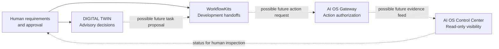

# Engineering Project Map

[Back to portfolio](README.md)

**Four related engineering concerns. One consistent approach: trace requirements, restrict consequential actions, and separate evidence from approval.**

This is a **conceptual relationship map**, **not** evidence that the four private projects are integrated, interoperable, deployed together, or qualified as a unified platform.

## Conceptual relationship

**How to read this diagram:** Solid arrows represent conceptual human involvement in decision support and development oversight. Dashed arrows represent **potential future interfaces**, not implemented integrations. The projects have distinct repositories, evidence requirements, and operational boundaries.

## Project responsibilities

| Project | Boundary being explored | Source of truth / verification question | Public case study |
| --- | --- | --- | --- |
| DIGITAL TWIN | Past personal records versus present reasoning and advice | Can a recommendation be explained without rewriting history or inventing personal facts? | [Read](case-studies/digital-twin.md) |
| WorkflowKits | Planning versus implementation versus independent review | Can a change be traced to governing requirements and an actual review record? | [Read](case-studies/workflowkits.md) |
| AI OS Gateway | Proposed action versus permission to execute | Does each consequential operation have valid authority and a defined outcome? | [Read](case-studies/ai-os-gateway.md) |
| AI OS Control Center | Project visibility versus authority to make changes | Can a status surface report uncertainty without silently repairing or approving anything? | [Read](case-studies/ai-os-control-center.md) |

## Example of a transferable engineering pattern

In engineering document control, a drawing's **current revision**, its **approval state**, and the fact that someone has **seen the drawing** are three different things. The same principle applies to AI-assisted workflows:

1. **Source:** Preserve the requirement or data version being used.
2. **Proposal:** Record what a model or developer suggests.
3. **Review:** Examine the actual candidate and specific test evidence.
4. **Authority:** Obtain authorization before a consequential change.
5. **Status:** Report what was verified, accepted, rejected, or remains unknown.

This is a transferable **methodology**, not a claim that the current private AI projects have been used on live construction projects or represent a certified engineering control system.

## Evidence boundary

*As of October 8, 2026*, the public case studies document selected private repository observations and design requirements. They do not establish completed end-to-end interoperability, independently reproduced system tests, production deployment, or performance improvements. The correct next public proof would be a separately approved synthetic demonstration with reproducible checks, not an unreviewed export of private working material.
