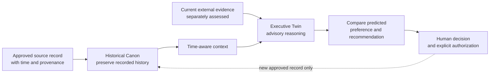

# DIGITAL TWIN — Evidence-Grounded Cognitive Decision Support

[Back to portfolio](../README.md)

**A personal research and engineering project exploring a time-aware AI decision-support system with explicit evidence, privacy, and human oversight.**

**Status:** Active research and private engineering work as of October 8, 2026. This is a public *case study*, not an open-source release or a claim of a deployed product.

## Problem

A personalized AI assistant may mix historical facts, inferred preferences, outdated assumptions, and recommendations into one answer. Without source provenance and clear boundaries, it becomes difficult to determine what the person actually said, what the system inferred, and what independent evidence supports.

## Objective

Design a cognitive digital twin that helps a person examine decisions, preserve the history of how their thinking changes, learn from new evidence, and receive recommendations that can *disagree* with a predicted personal preference.

Here, **digital twin** means a cognitive and decision-support model. It is not a BIM model or a physical infrastructure twin.

## Architecture and design approach

The project's documented design separates two responsibilities:

| Responsibility | Intended purpose |
| --- | --- |
| **Historical Canon** | Preserve time-stamped source records and changes in stated beliefs, decisions, and preferences without rewriting history. |
| **Executive Twin** | Generate advisory reasoning informed by the historical record while remaining open to corrections from current evidence. |

The research and engineering roadmap also includes:

- **Source provenance:** Track the origin, timestamp, and confidence of information so an inference is not presented as a recorded fact.
- **Temporal context:** Distinguish what was true or preferred at one point in time from what is currently supported.
- **Evidence-based recommendations:** Keep the prediction of a person's likely choice separate from independent assessment of the available evidence.
- **Evaluation:** Define future fidelity, decision-quality, and regression tests rather than relying on plausible-sounding output.
- **Human control:** Require explicit authority for consequential external actions and keep sensitive personal sources private by default.

These are documented design goals and workstreams, **not assertions that every module is implemented, integrated, or independently qualified**.

## Conceptual architecture

The diagram below illustrates the **intended reasoning boundaries** from the published project description. It is not a depiction of a tested end-to-end implementation.

**Design boundary:** Historical source records should not be silently overwritten to make a recommendation appear consistent. Advisory output should not independently change identity, values, private data, or external systems.

## Hypothetical decision trace

This example uses **synthetic information** to illustrate the intended behavior; it is not a transcript or a passed system test.

| Step | Example |
| --- | --- |
| Previously recorded preference | "I favored option A when cost was the main constraint." |
| New evidence | A newer, documented comparison suggests option B has better reliability for the current task. |
| Prediction | The model may still predict a preference for A from the historical record. |
| Evidence-based advice | Recommend B based on the newer evidence, with its source and uncertainty made explicit. |
| Human authority | Present both perspectives and ask for a decision; do not automatically change the historical record or take external action. |

## Proposed evaluation checks

These are **evaluation candidates**, not completed or passing tests.

| Test scenario | Expected result |
| --- | --- |
| An old preference conflicts with a newer approved statement | Retain the historical record while identifying the current source and timestamp. |
| A model infers a preference without an explicit source | Label it as an inference rather than a recorded personal fact. |
| Independent evidence conflicts with predicted behavior | Report the discrepancy; do not distort the evidence to match the prediction. |
| An advisory response suggests an external action | Require separate, explicit authorization before execution. |

**Related research context:** The [NIST AI Risk Management Framework](https://www.nist.gov/itl/ai-risk-management-framework) addresses governance, measurement, risk management, and trustworthiness for AI systems. This link is background context only; no NIST conformity assessment or certification is claimed.

## Engineering tradeoffs

**Personalization vs. correction.** A faithful prediction of past behavior is not automatically the best present recommendation. Preserving both views exposes useful disagreements.

**Convenience vs. provenance.** Retaining source references and time context adds complexity but makes it possible to investigate a questionable answer.

**Capability vs. privacy.** More personal context could improve relevance, but unreviewed ingestion or publication would increase exposure. The project favors deliberate source selection and restricted access.

## My contribution

I define the project objectives, requirements, decision boundaries, information architecture, and evidence expectations. I coordinate AI-assisted research and implementation, examine review findings, and distinguish owner decisions from model-generated work and independently validated results.

The work demonstrates systems thinking, requirements engineering, traceability, AI-assisted delivery, and attention to human oversight. It does not imply that I personally wrote every line of software without assistance.

## Evidence and current limitations

*Documentation snapshot: October 8, 2026.*

The private project's README identifies active research and engineering, the Historical Canon / Executive Twin distinction, and a milestone roadmap covering provenance, memory, decision modeling, evaluation, and later multimodal capabilities.

That documentation establishes **project intent and recorded structure**, not successful end-to-end execution. No public demo, independently verified fidelity score, production deployment, clinical capability, or security certification is claimed. Sensitive source material, personal records, private architecture artifacts, and operational access details are intentionally excluded.

The underlying implementation repository remains private. This case study is the public reference for employers and collaborators.
